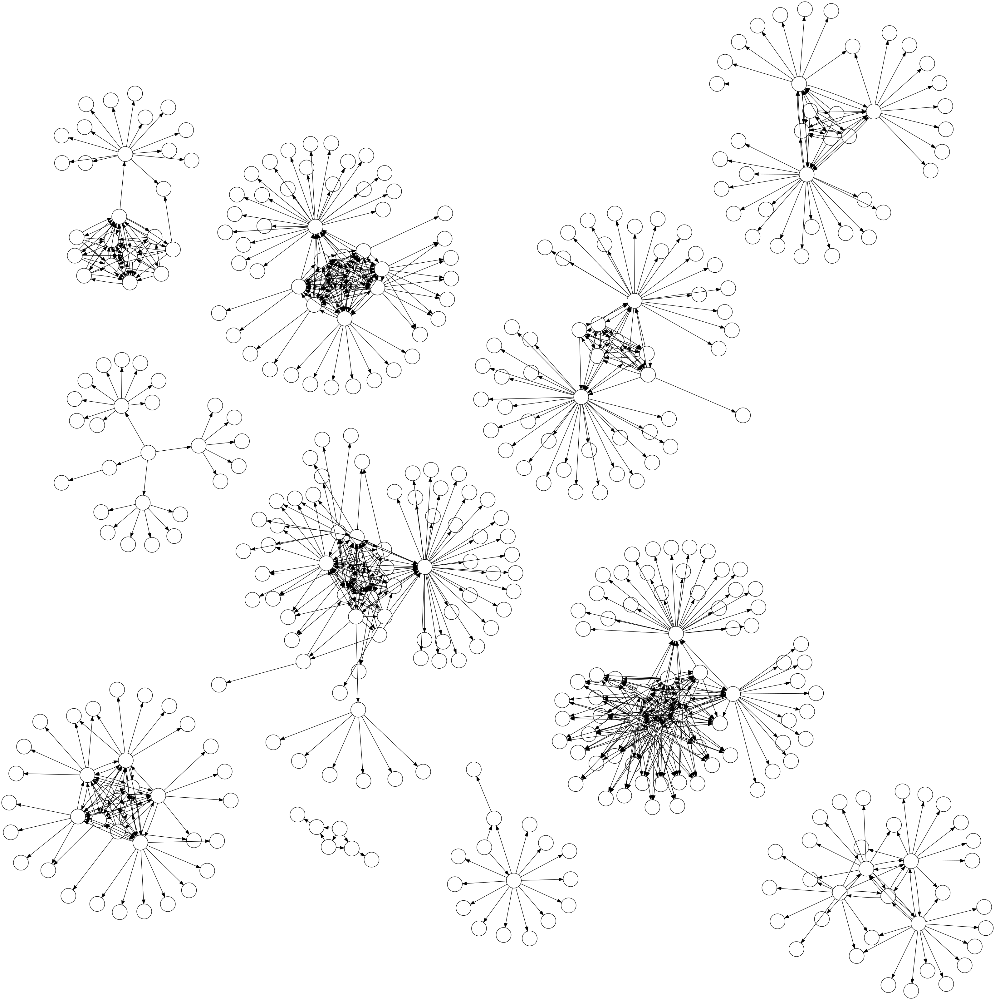

# Nodot

> A simple graph parser with visualization options and export to dot

<p align="center"></p>

`nodot` aims to simplify the process of parsing raw graphs and visualizing them.
It can directly read a graph as a list of edges (or a list of paths), and it also supports many features of [Graphviz](https://graphviz.org/) such as style options or subgraphs.

By default, `nodot` assumes that the graph is undirected, disables the labels and renders the graph using the [neato](https://graphviz.org/docs/layouts/neato/) engine.

## Usage

```
USAGE:
    nodot [OPTIONS] <INPUT>

ARGS:
    <INPUT>    Input file

OPTIONS:
    -a, --autolabel          Use node id as default label
    -d, --directed           Directed graph
    -h, --help               Print help information
    -l, --layout <LAYOUT>    Set layout engine [default: neato]
    -o, --output <OUTPUT>    Output file (dot, png, jpeg, svg, pdf...)
    -s, --shape <SHAPE>      Default node shape [default: circle]
    -V, --version            Print version information
```

For instance, running `nodot -d mygraph.txt -o mygraph.png` will read `mygraph.txt` as a directed graph, and will export its visualization to `mygraph.png`.

## Install

To build the executable, just run `cargo build -r`.
The binary will then be located at `target/release/nodot`.

Alternatively, you can run it directly with cargo: `cargo run -r -- <ARGS>`.

If you want to export visualizations, make sure to [install Graphviz](https://www.graphviz.org/download/) first.

## Examples

### List of edges

The most basic format is just a list of edges, with one edge per line:
```
a b
b c
a c
b d
c d
```

### List of paths

Just as in `dot`, you can directly describe paths by chaining edges:
```
a b c a
b d c
```

### Group of nodes

You can also connect group of nodes (delimited by `{ }`), which will create an edge for every node in the group.

For instance, `a { b c d }` is equivalent to:
```
a b
a c
a d
```

### Adding styles

Both nodes and edges can have custom styles (indicated by `:`), for instance:
```
a: fillcolor=red
a b: style="dashed"
```
will fill node `a` with red and draw a dashed edge between `a` and `b`.

For more examples of styling options, have a look at the [Graphviz gallery](https://graphviz.org/gallery/).

## Side notes

The graph parser was written using `nom`, a rust library for parser combinators.
If you're interested in it, you should definitely [check out the doc](https://docs.rs/nom/latest/nom/index.html).
